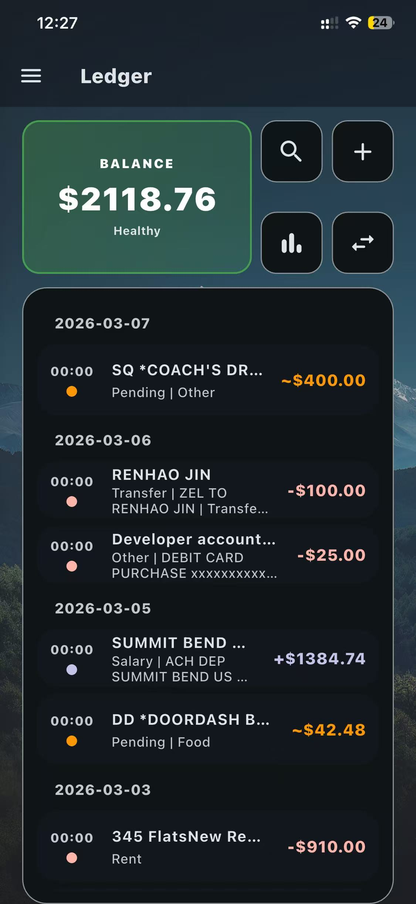
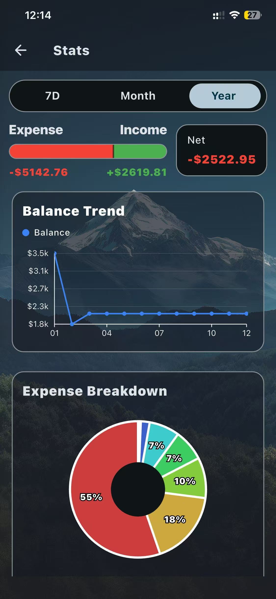
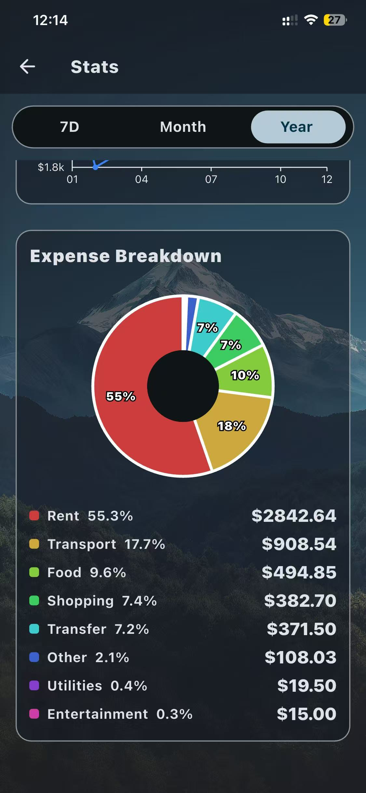
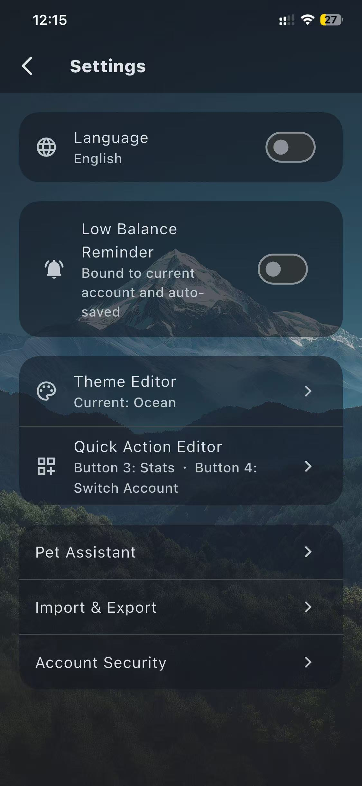

# Ledger App

[English](README.en.md) | [中文](README.zh-CN.md)
[Demo](#demo)

A multi-platform ledger app built with Flutter, supporting offline local bookkeeping, cloud sync, reporting, recurring transactions, and external bill import.

## Features

- Multi-account ledger management (`income`, `expense`, `pending`)
- Offline-first local storage with Drift
- Supabase authentication and cloud bill synchronization
- Reports and deep analysis (trends, category ratio, history summary)
- External bill import (WeChat Pay / Alipay / PNC)
- Recurring transaction management
- Chinese/English language switching, theme switching, custom background image, and pet overlay UI

## Tech Stack

- `Flutter` / `Dart`
- `drift` + `sqlite` (local data)
- `supabase_flutter` (auth + cloud sync)
- `fl_chart` (charts)
- `shared_preferences` (persistent settings)
- `image_picker` / `file_picker` (image & file import)

## Project Structure

```text
lib/
  app/                 # App-level config (theme, settings, app shell)
  data/db/             # Drift database and table definitions
  features/
    auth/              # Login / password reset
    ledger/            # Ledger home and transaction flows
    reports/           # Reporting and analytics
    import/            # External bill import
    settings/          # Settings and preferences
  services/            # Cloud sync, background services, logging
  ui/pet/              # Pet overlay UI and control logic
supabase/
  ledger_bills_schema.sql  # Supabase schema + RLS policies
docs/
  ARCHITECTURE.en.md   # Module and data-flow notes (English)
```

## Quick Start

1. Install Flutter 3.35+ and ensure `dart --version` is `>= 3.11.x`.
2. Install dependencies:

```bash
flutter pub get
```

3. Run the app:

```bash
flutter run
```

## App Download

- Releases: https://github.com/RonganBai/ledger/releases
- Latest release: https://github.com/RonganBai/ledger/releases/latest

## Supabase Setup

1. Create a Supabase project.
2. Run [`supabase/ledger_bills_schema.sql`](supabase/ledger_bills_schema.sql) in the SQL editor.
3. Replace `Supabase.initialize(url, anonKey)` in `lib/main.dart` with your project config.

For public repositories, avoid hardcoding project keys. Prefer environment variables or build-time injection.

## Demo

Quick preview of the core flows and pages:

- Main flow animation: `docs/media/demo.gif`
- Home page: `docs/media/home.jpg`
- Add bill steps: `docs/media/Add Bill1.jpg`, `docs/media/Add Bill2.jpg`
- Reports: `docs/media/report1.jpg`, `docs/media/report2.jpg`
- Settings: `docs/media/settings.jpg`


### Screenshots

| Home | Add Bill |
| --- | --- |
|  |  |

| Add Bill (Step 2) | Reports |
| --- | --- |
|  |  |

| Reports (More) | Settings |
| --- | --- |
|  |  |

## Development & Contribution

- Contribution process: [`CONTRIBUTING.en.md`](CONTRIBUTING.en.md)
- Architecture notes: [`docs/ARCHITECTURE.en.md`](docs/ARCHITECTURE.en.md)
- PR template: `.github/PULL_REQUEST_TEMPLATE.md`

## Suggested Roadmap

- Improve cloud sync conflict strategy
- Increase unit/integration test coverage
- Make bill import rules configurable
- Standardize release and changelog workflow

## License

This project is licensed under [MIT License](LICENSE).
